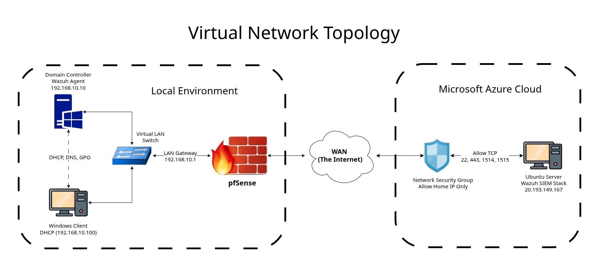
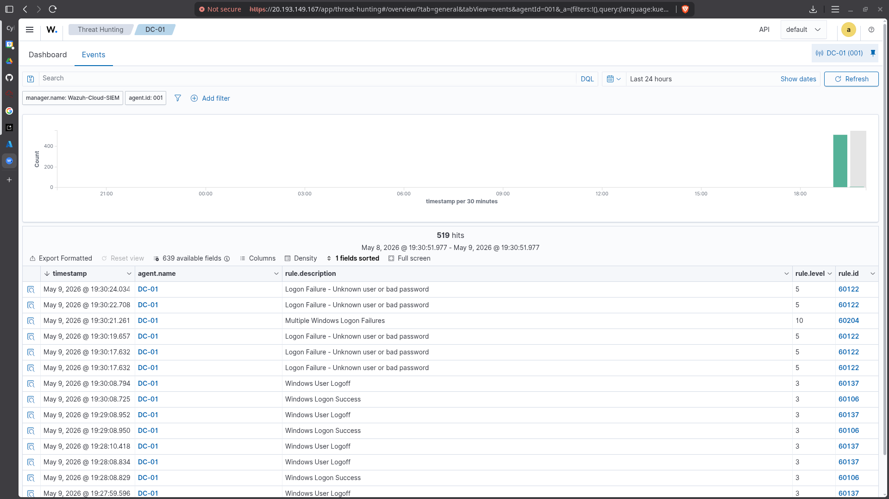

# Hybrid-Cloud SIEM Deployment

## Objective
The goal of this project is to deploy a cloud-hosted Security Information and Event Management (SIEM) platform to ingest logs from local Active Directory environment. By using a hybrid-cloud approach, this project bypasses local hardware constraints while establishing secure, encrypted log-forwarding agents and enforcing strict firewall policies across both local and cloud perimeters.

## Technologies Used
* **Cloud Provider:** Microsoft Azure (100$ Free Credits for Students)
* **SIEM:** Wazuh (Manager, Indexer, Dashboard)
* **Operating Systems:** Ubuntu Server 24.04 LTS (Cloud), Windows Server (Local)
* **Networking & Security:** pfSense, Azure Network Security Groups (NSG), PowerShell

## Architecture
The architecture consists of a local Windows Server sitting safely behind a pfSense virtual firewall. The Wazuh agent installed on the Windows Server communicates securely over the internet (WAN) to an Azure cloud instance running the Wazuh SIEM stack.

## Security Measures
To ensure an enterprise-grade security posture, multiple layers of access control were implemented:
* **Strict Egress Filtering (pfSense):** Configured the local pfSense firewall to drop all unknown outbound traffic. Outbound rules were explicitly created to allow only HTTPS (443), HTTP (80), DNS (53), and Wazuh agent communication (Ports 1514 & 1515).
* **Network Security Groups (Azure):** Applied the principle of **Implicit Deny** on the cloud perimeter. Inbound rules on the Azure VM were strictly IP-whitelisted, meaning Ports 22 (SSH), 443 (Dashboard), 1514, and 1515 drop all packets that do not originate from the my home's public IP address.

## Proof of Concept: Threat Detection
To validate the SIEM's ingestion and alerting capabilities, an attack was simulated on the local network:
1. Enabled Windows Audit Policies for **Logon Events** (Success and Failure) via `secpol.msc`.
2. Simulated a brute-force attack by intentionally failing logins on the Windows Server multiple times to generate **Event ID 4625**.
3. The Wazuh agent successfully forwarded the logs through the pfSense firewall and over the WAN to the Azure indexer.
4. The Wazuh Cloud Dashboard successfully analyzed the logs and triggered a Level 10 High-Severity Alert for **"Multiple Windows Logon Failures."**

### Alert Dashboard

